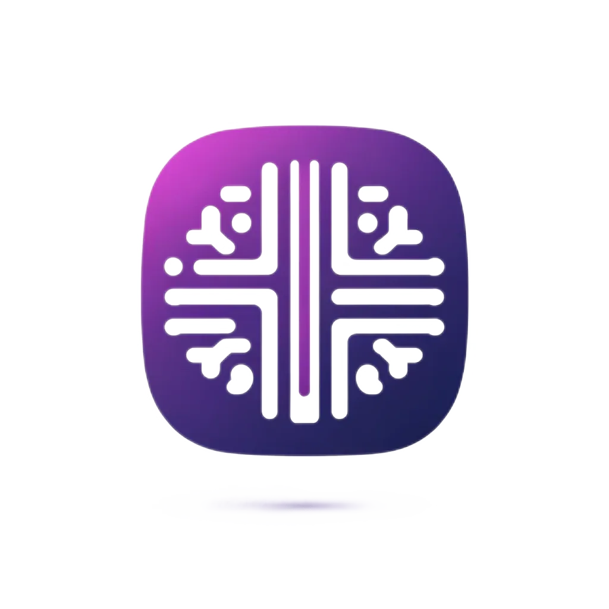
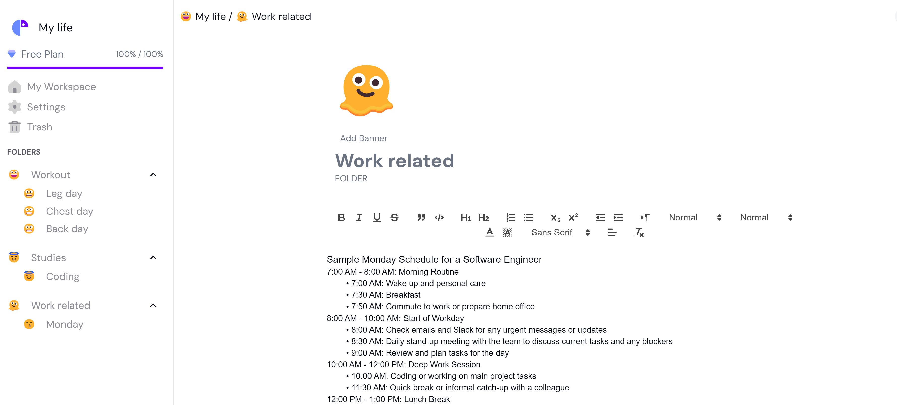

<div align="center" id="top" className="mb-10">


&#xa0;

  

<a href="https://jj-notable.up.railway.app/">Demo</a>

</div>

# Welcome to Notable, Your Premier Notion Clone - Next.js SaaS Application

Experience unparalleled team collaboration with Notable, a cutting-edge SaaS platform designed to enhance productivity dynamically. Built with Next.js 13 and adorned with the latest technologies like Stripe for secure payments, Drizzle ORM for efficient data management, Tailwind CSS for intuitive styling, Supabase for a scalable backend, and WebSockets for real-time interactions, Notable offers a modern workspace for teams and individuals to thrive in real time. Perfect for startups and large enterprises alike, Notable seamlessly integrates advanced collaboration tools into your daily operations, setting a new standard for what a collaborative platform can achieve.

## Features

### Real-Time Interaction
- **Real-time Cursors**: See where others are editing in real-time.
- **Real-time Text Selection**: Collaborative text selection and editing.
- **Real-time Database and Collaboration**: Instantaneous data updates across sessions.
- **Real-time Presence**: See who's online and collaborating.
- **Custom Rich Text Editor**: Rich formatting options for enhanced text editing.

### User and Data Management
- **Move to Trash Functionality**: Easily discard unwanted changes or restore them.
- **Custom Emoji Picker**: Enhance communication with an extensive range of emojis.
- **Profile Settings**: Users can update their personal and professional details seamlessly.
- **Supabase Row Level Policy**: Fine-grained access control to secure user data.
- **Optimistic UI**: Provides a snappy user experience by predicting server responses.

### Authentication and Security
- **Custom Authentication**: Tailored authentication solutions to meet diverse requirements.
- **Custom Email 2FA Invitation**: Two-factor authentication for enhanced account security.

### Subscription and Payments
- **Monthly Payments**: Integrated Stripe to handle recurring payments smoothly.
- **Manage Payments in a Portal**: A user-friendly portal for managing subscriptions and billing details.
- **Creating Free Plan Restrictions**: Implement features and usage limits for different subscription tiers.

### Styling and Responsiveness
- **Light Mode and Dark Mode**: Adaptable UI to reduce eye strain and enhance accessibility.
- **Responsive Design**: Ensures a seamless experience on both desktop and mobile devices.

### Deployment and Development
- **Next.js 13 App Router**: Utilizes the latest routing enhancements for performance optimizations.
- **Websockets**: Real-time bi-directional communication between clients and servers.
- **Deployment Guidelines**: Detailed instructions for deploying the app across various environments.

## Getting Started

### Prerequisites
- Node.js 12.x or higher
- A Supabase account
- A Stripe account for handling payments

### Installation

Clone the repository:
```bash
git clone https://github.com/your-repository-url.git
cd notion-clone
```

Install dependencies:
```bash
npm install
```

Start the development server:
```bash
npm run dev
```

### Environment Configuration
Ensure your `.env` file is set up with the necessary API keys and database URLs:
```
NEXT_PUBLIC_SUPABASE_URL=your_supabase_url
NEXT_PUBLIC_SUPABASE_ANON_KEY=your_supabase_anon_key
STRIPE_SECRET_KEY=your_stripe_secret_key
```

## Documentation
For more detailed information about setup and configuration, visit the [Documentation Page](#).

## Support
For support, email me at jeff.jiang13@gmail.com or open an issue in the GitHub repository.

## Contributing
Contributions are what make the open-source community such an amazing place to learn, inspire, and create. Any contributions you make are **greatly appreciated**.

Check our [contributing guidelines](#) for details on our code of conduct, and the process for submitting pull requests.
